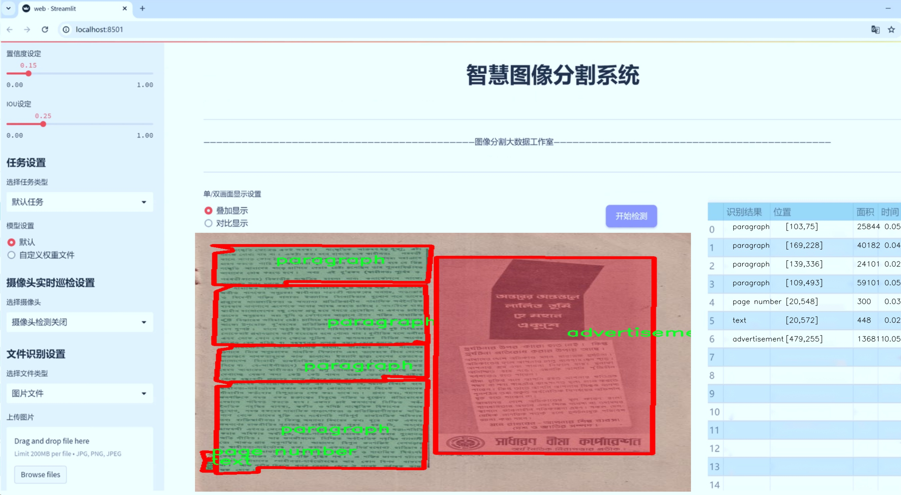
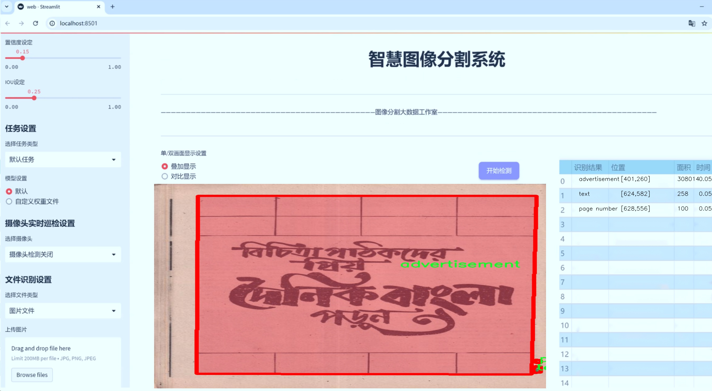
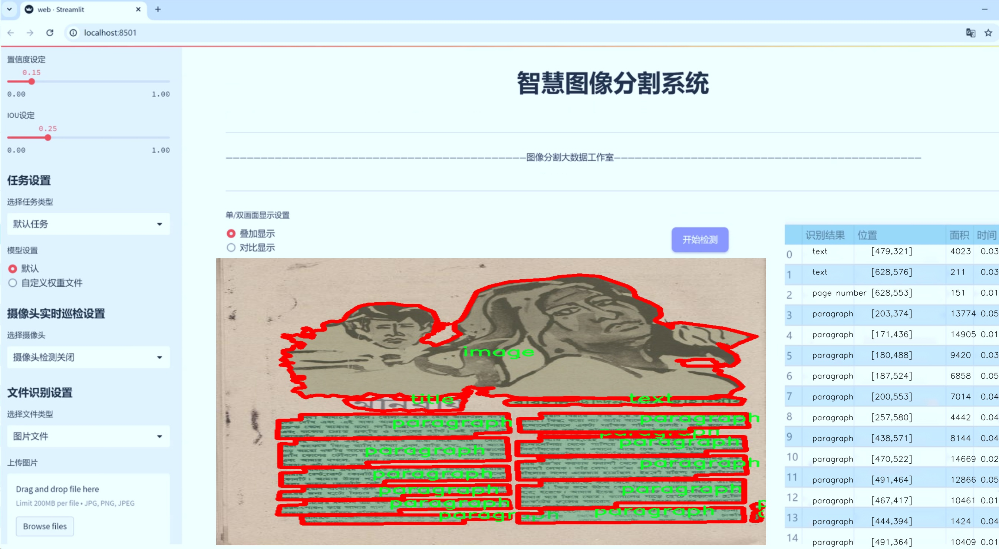
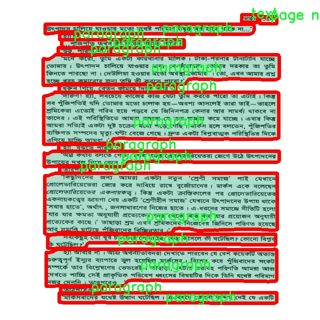
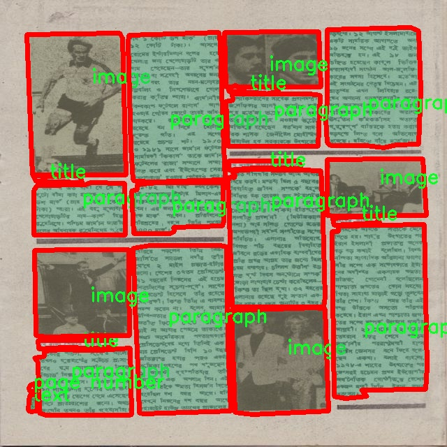
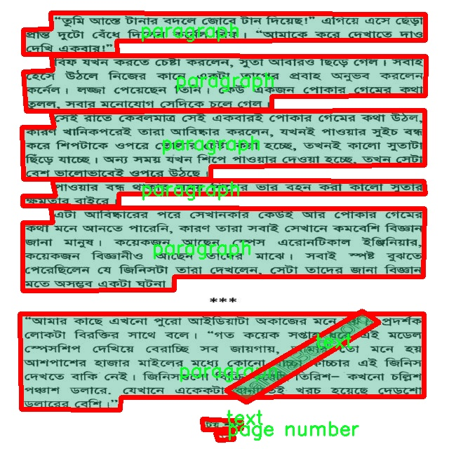
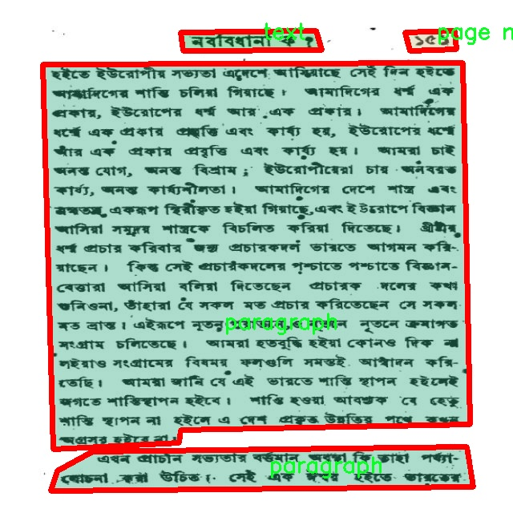

# 文档内容分割系统源码＆数据集分享
 [yolov8-seg-C2f-REPVGGOREPA＆yolov8-seg-goldyolo等50+全套改进创新点发刊_一键训练教程_Web前端展示]

### 1.研究背景与意义

项目参考[ILSVRC ImageNet Large Scale Visual Recognition Challenge](https://gitee.com/YOLOv8_YOLOv11_Segmentation_Studio/projects)

项目来源[AAAI Global Al lnnovation Contest](https://kdocs.cn/l/cszuIiCKVNis)

研究背景与意义

随着信息技术的迅猛发展，文档数字化已成为现代社会的重要趋势。大量的纸质文档被转化为电子格式，然而，如何有效地从这些电子文档中提取有价值的信息，仍然是一个亟待解决的挑战。传统的文档处理方法往往依赖于人工标注和规则引擎，效率低下且易受人为因素影响。近年来，深度学习技术的快速发展为文档内容的自动化分割与识别提供了新的解决方案，尤其是基于卷积神经网络（CNN）的实例分割模型在图像处理领域取得了显著的成果。

在众多实例分割模型中，YOLO（You Only Look Once）系列因其高效的实时检测能力而备受关注。YOLOv8作为该系列的最新版本，具备了更强的特征提取能力和更快的推理速度，能够在复杂的文档结构中实现高精度的内容分割。通过对YOLOv8进行改进，我们可以针对文档内容的特定需求，设计出更加适合文档分析的分割系统。尤其是在处理包含多种信息类型的文档时，如广告、标题、段落、表格等，改进后的YOLOv8模型将能够有效提升分割的准确性和效率。

本研究的意义在于，首先，通过构建基于改进YOLOv8的文档内容分割系统，我们能够为文档信息提取提供一种高效、自动化的解决方案。具体而言，研究将利用包含2200张图像的FYDP数据集，该数据集涵盖了8个类别，包括广告、标题、段落、表格等。这些类别的多样性为模型的训练和测试提供了丰富的样本，有助于提高模型的泛化能力。其次，文档内容的精确分割不仅能够提升信息提取的效率，还能为后续的自然语言处理、信息检索等任务奠定基础，从而推动智能文档处理技术的发展。

此外，改进YOLOv8的文档内容分割系统还具有广泛的应用前景。在教育、法律、医疗等领域，文档处理的需求日益增长，自动化的文档分析工具将大大减轻人工处理的负担，提高工作效率。例如，在教育领域，教师可以利用该系统快速提取教材中的重要信息，辅助教学；在法律领域，律师可以通过系统自动分析合同中的关键条款，提升工作效率；在医疗领域，医生可以快速获取病历中的重要数据，辅助诊断决策。

综上所述，基于改进YOLOv8的文档内容分割系统的研究，不仅在理论上丰富了深度学习在文档处理领域的应用研究，也在实践中为各行业提供了高效的信息处理工具，具有重要的学术价值和现实意义。通过本研究，我们希望能够推动文档内容分析技术的进步，为信息社会的发展贡献一份力量。

### 2.图片演示







##### 注意：由于此博客编辑较早，上面“2.图片演示”和“3.视频演示”展示的系统图片或者视频可能为老版本，新版本在老版本的基础上升级如下：（实际效果以升级的新版本为准）

  （1）适配了YOLOV8的“目标检测”模型和“实例分割”模型，通过加载相应的权重（.pt）文件即可自适应加载模型。

  （2）支持“图片识别”、“视频识别”、“摄像头实时识别”三种识别模式。

  （3）支持“图片识别”、“视频识别”、“摄像头实时识别”三种识别结果保存导出，解决手动导出（容易卡顿出现爆内存）存在的问题，识别完自动保存结果并导出到tempDir中。

  （4）支持Web前端系统中的标题、背景图等自定义修改，后面提供修改教程。

  另外本项目提供训练的数据集和训练教程,暂不提供权重文件（best.pt）,需要您按照教程进行训练后实现图片演示和Web前端界面演示的效果。

### 3.视频演示

[3.1 视频演示](https://www.bilibili.com/video/BV1fnmKYzEWj/)

### 4.数据集信息展示

##### 4.1 本项目数据集详细数据（类别数＆类别名）

nc: 8
names: ['advertisement', 'caption', 'image', 'page number', 'paragraph', 'table', 'text', 'title']


##### 4.2 本项目数据集信息介绍

数据集信息展示

在本研究中，我们采用了名为“FYDP”的数据集，以支持改进YOLOv8-seg的文档内容分割系统的训练和验证。FYDP数据集的设计旨在涵盖多种文档元素，确保模型能够有效识别和分割不同类型的内容，从而提升文档处理的自动化水平和准确性。该数据集包含八个类别，分别为广告（advertisement）、标题（title）、文本（text）、段落（paragraph）、图像（image）、表格（table）、页码（page number）和说明文字（caption）。这些类别的选择反映了文档内容的多样性和复杂性，使得模型在处理实际应用场景时能够具备更强的适应能力。

首先，广告类别主要包含各种形式的宣传信息，通常以图像和文本的结合形式出现。这一类别的样本将帮助模型学习如何在文档中定位和分割出具有视觉吸引力的广告内容，从而为用户提供更为直观的信息展示。其次，标题类别则是文档的核心部分，通常用于引导读者的注意力。通过对标题的有效识别，模型能够更好地理解文档的结构和主题，进而提升整体的信息提取效率。

文本和段落类别是FYDP数据集的基础组成部分，涵盖了文档中的主要信息内容。文本类别包含单独的文本块，而段落类别则由多个句子组成，形成完整的思想表达。模型在训练过程中将学习如何准确分割这些文本元素，确保信息的完整性和可读性。此外，页码类别的存在则是为了帮助模型在多页文档中进行内容的连续性识别，确保用户在查阅信息时能够轻松找到所需的页码。

图像和表格类别的引入则进一步丰富了数据集的内容。图像类别包含各种插图、照片和图形，这些视觉元素在文档中通常起到辅助说明的作用。模型需要能够识别这些图像，并将其与相关文本进行关联，以便提供更为全面的信息解读。表格类别则包含结构化的数据，通常用于展示统计信息或对比分析。通过对表格的有效分割，模型能够帮助用户快速获取关键信息，提升数据处理的效率。

最后，说明文字类别的设置为模型提供了更多的上下文信息。这类文本通常用于解释图像或表格中的内容，帮助读者更好地理解文档的整体信息。通过对这些说明文字的准确识别，模型将能够更全面地把握文档的语义结构，从而提升信息提取的准确性。

综上所述，FYDP数据集的多样性和丰富性为改进YOLOv8-seg的文档内容分割系统提供了坚实的基础。通过对这八个类别的深入学习，模型将能够在实际应用中实现高效、准确的文档内容识别与分割，推动文档处理技术的进一步发展。










### 5.全套项目环境部署视频教程（零基础手把手教学）

[5.1 环境部署教程链接（零基础手把手教学）](https://www.bilibili.com/video/BV1jG4Ve4E9t/?vd_source=bc9aec86d164b67a7004b996143742dc)


[5.2 安装Python虚拟环境创建和依赖库安装视频教程链接（零基础手把手教学）](https://www.bilibili.com/video/BV1nA4VeYEze/?vd_source=bc9aec86d164b67a7004b996143742dc)

### 6.手把手YOLOV8-seg训练视频教程（零基础小白有手就能学会）

[6.1 手把手YOLOV8-seg训练视频教程（零基础小白有手就能学会）](https://www.bilibili.com/video/BV1cA4VeYETe/?vd_source=bc9aec86d164b67a7004b996143742dc)


按照上面的训练视频教程链接加载项目提供的数据集，运行train.py即可开始训练



     Epoch   gpu_mem       box       obj       cls    labels  img_size
     1/200     0G   0.01576   0.01955  0.007536        22      1280: 100%|██████████| 849/849 [14:42<00:00,  1.04s/it]
               Class     Images     Labels          P          R     mAP@.5 mAP@.5:.95: 100%|██████████| 213/213 [01:14<00:00,  2.87it/s]
                 all       3395      17314      0.994      0.957      0.0957      0.0843

     Epoch   gpu_mem       box       obj       cls    labels  img_size
     2/200     0G   0.01578   0.01923  0.007006        22      1280: 100%|██████████| 849/849 [14:44<00:00,  1.04s/it]
               Class     Images     Labels          P          R     mAP@.5 mAP@.5:.95: 100%|██████████| 213/213 [01:12<00:00,  2.95it/s]
                 all       3395      17314      0.996      0.956      0.0957      0.0845

     Epoch   gpu_mem       box       obj       cls    labels  img_size
     3/200     0G   0.01561    0.0191  0.006895        27      1280: 100%|██████████| 849/849 [10:56<00:00,  1.29it/s]
               Class     Images     Labels          P          R     mAP@.5 mAP@.5:.95: 100%|███████   | 187/213 [00:52<00:00,  4.04it/s]
                 all       3395      17314      0.996      0.957      0.0957      0.0845


### 7.50+种全套YOLOV8-seg创新点代码加载调参视频教程（一键加载写好的改进模型的配置文件）

[7.1 50+种全套YOLOV8-seg创新点代码加载调参视频教程（一键加载写好的改进模型的配置文件）](https://www.bilibili.com/video/BV1Hw4VePEXv/?vd_source=bc9aec86d164b67a7004b996143742dc)

### 8.YOLOV8-seg图像分割算法原理

原始YOLOv8-seg算法原理

YOLOv8-seg算法是YOLO系列中的最新成员，代表了目标检测和分割领域的前沿技术。相较于其前身YOLOv5，YOLOv8在检测精度和速度上都实现了显著的提升。其设计理念旨在满足实时检测的需求，同时在多种应用场景中保持高效性和准确性。YOLOv8的网络结构由输入端、骨干网络、颈部网络和头部网络四个主要部分组成，每个部分在整体架构中扮演着至关重要的角色。

在输入端，YOLOv8采用了马赛克数据增强技术，这种方法通过将多张图像拼接在一起，增加了训练数据的多样性，从而提升了模型的泛化能力。此外，YOLOv8还引入了自适应锚框计算和自适应灰度填充，这些技术的应用使得模型能够更好地适应不同的输入条件和目标特征。自适应锚框计算的优势在于，它能够根据输入图像的特征动态调整锚框的大小和形状，从而提高检测的准确性。

骨干网络是YOLOv8的核心部分，其采用了C2f和SPPF（Spatial Pyramid Pooling Fusion）结构。C2f模块的设计灵感来源于YOLOv7的ELAN结构，通过增加分支和跨层连接，C2f模块能够有效地学习残差特征，增强模型的梯度流动性。这种结构使得网络在特征表示能力上有了显著提升，能够更好地捕捉复杂的目标特征。而SPPF则通过空间金字塔池化的方式，进一步增强了模型对不同尺度目标的感知能力，使得YOLOv8在处理多尺度目标时表现得更加出色。

颈部网络采用了路径聚合网络（PAN）结构，这一设计旨在加强不同尺度特征的融合能力。PAN通过将低层特征与高层特征进行有效结合，提升了模型对小目标的检测能力。这种特征融合的策略使得YOLOv8在处理复杂场景时，能够更好地理解目标之间的关系，从而提高检测的准确性。

头部网络是YOLOv8的最后一部分，其主要功能是进行目标分类和检测框的筛选。与以往的耦合头不同，YOLOv8采用了解耦头结构，将分类和回归任务分开处理。这种设计的优势在于，各个任务可以更加专注于自身的目标，从而有效解决复杂场景下的定位不准和分类错误的问题。此外，YOLOv8还引入了Anchor-Free目标检测方法，这一方法不再依赖于预定义的锚框，而是通过回归方式直接预测目标的位置和大小。这种创新使得YOLOv8在处理不同尺度和形状的目标时，能够更加灵活和高效。

在损失计算方面，YOLOv8采用了Task-Aligned Assigner分配策略，根据分类与回归的分数加权结果选择正样本。损失计算涵盖了分类和回归两个分支，其中分类分支使用二元交叉熵损失（BCELoss）进行训练，而回归分支则结合了分布焦点损失（DFLoss）和完全交并比损失函数（CIOULoss），以提升模型对边界框预测的精准性。这种多层次的损失计算策略使得YOLOv8在训练过程中能够更好地平衡分类和回归任务的需求，从而提升整体性能。

YOLOv8的设计理念不仅关注模型的精度和速度，还强调了模型的轻量化，使其能够在各种嵌入式设备上进行部署。这一特性使得YOLOv8在实际应用中具备了更强的灵活性和适应性，能够满足不同场景下的实时检测需求。

总的来说，YOLOv8-seg算法通过对网络结构的创新和优化，实现了目标检测和分割的高效结合。其在输入端的增强技术、骨干网络的特征学习、颈部网络的特征融合以及头部网络的解耦设计，都为其在复杂场景下的应用提供了强有力的支持。随着YOLOv8的不断发展，未来在目标检测和分割领域的应用前景将更加广阔。


### 9.系统功能展示（检测对象为举例，实际内容以本项目数据集为准）

图9.1.系统支持检测结果表格显示

  图9.2.系统支持置信度和IOU阈值手动调节

  图9.3.系统支持自定义加载权重文件best.pt(需要你通过步骤5中训练获得)

  图9.4.系统支持摄像头实时识别

  图9.5.系统支持图片识别

  图9.6.系统支持视频识别

  图9.7.系统支持识别结果文件自动保存

  图9.8.系统支持Excel导出检测结果数据


### 10.50+种全套YOLOV8-seg创新点原理讲解（非科班也可以轻松写刊发刊，V11版本正在科研待更新）

#### 10.1 由于篇幅限制，每个创新点的具体原理讲解就不一一展开，具体见下列网址中的创新点对应子项目的技术原理博客网址【Blog】：


[10.1 50+种全套YOLOV8-seg创新点原理讲解链接](https://gitee.com/qunmasj/good)

#### 10.2 部分改进模块原理讲解(完整的改进原理见上图和技术博客链接)【如果此小节的图加载失败可以通过CSDN或者Github搜索该博客的标题访问原始博客，原始博客图片显示正常】

### YOLOv8简介
#### YOLOv8是什么？
YOLOv8是Ultralytics公司推出的基于对象检测模型的YOLO最新系列，它能够提供截至目前最先进的对象检测性能。

借助于以前的YOLO模型版本支持技术，YOLOv8模型运行得更快、更准确，同时为执行任务的训练模型提供了统一的框架，这包括：

目标检测
实例分割
图像分类
在撰写本文时，Ultralytics的YOLOv8存储库中其实还有很多功能有待添加，这包括训练模型的整套导出功能等。此外，Ultralytics将计划在Arxiv上发布一篇相关的论文，将对YOLOv8与其他最先进的视觉模型进行比较。

#### YOLOv8的新功能
Ultralytics为YOLO模型发布了一个全新的存储库（https://github.com/ultralytics/ultralytics）。该存储库被构建为用于训练对象检测、实例分割和图像分类模型的统一框架。

以下列举的是这个新版本的一些关键功能：

用户友好的API（命令行+Python）。
更快、更准确。
支持：
目标检测，
实例分割和
图像分类。
可扩展到所有以前的版本。
新的骨干网络。
新的Anchor-Free head对象检测算法。
新的损失函数。
此外，YOLOv8也非常高效和灵活，它可以支持多种导出格式，而且该模型可以在CPU和GPU上运行。

#### YOLOv8中提供的子模型


YOLOv8模型的每个类别中共有五个模型，以便共同完成检测、分割和分类任务。其中，YOLOv8 Nano是最快和最小的模型，而YOLOv8Extra Large（YOLOv8x）是其中最准确但最慢的模型。

YOLOv8这次发行中共附带了以下预训练模型：

在图像分辨率为640的COCO检测数据集上训练的对象检测检查点。
在图像分辨率为640的COCO分割数据集上训练的实例分割检查点。
在图像分辨率为224的ImageNet数据集上预处理的图像分类模型。
### 高效网络架构 CloAtt简介
众所周知，自从 ViTs 提出后，Transformer 基本横扫各大 CV 主流任务，包括视觉识别、目标检测和语义分割等。然而，一个比较棘手的问题就是这个架构参数量和计算量太大，所以一直被广受诟病。因此，后续有不少工作都是朝着这个方向去改进，例如 Swin-Transformer 在局部非重叠窗口中进行注意力计算，而 PVT 中则是使用平均池化来合并 token 以进一步压缩耗时。然而，这些 ViTs 由于其参数量太大以及高 FLOPs 并不适合部署到移动设备。如果我们直接缩小到适合移动设备的尺寸时，它们的性能又会显著降低。


#### MobileViT
因此，出现了不少工作聚焦于探索轻量级的视觉变换器，使 ViTs 适用于移动设备，CVHub 此前也介绍过不少的工作，大家有兴趣可以翻阅历史文章读读。例如，苹果团队提出的 MobileViT 研究了如何将 CNN 与 Transformer 相结合，而另一个工作 MobileFormer 则将轻量级的 MobileNet 与 Transformer 进行融合。此外，最新提出的 EdgeViT 提出了一个局部-全局-局部模块来聚合信息。以上工作的目标都是设计具有高性能、较少参数和低 FLOPs 的移动端友好型模型。


#### EdgeViT
然而，作者从频域编码的角度认为，在现有的轻量级模型中，大多数方法只关注设计稀疏注意力，以有效地处理低频全局信息，而使用相对简单的方法处理高频局部信息。具体而言，大多数模型如 EdgeViT 和 MobileViT，只是简单使用原始卷积提取局部表示，这些方法仅使用卷积中的全局共享权重处理高频本地信息。其他方法，如 LVT ，则是首先将标记展开到窗口中，然后使用窗口内的注意力获得高频信息。这些方法仅使用特定于每个 Token 的上下文感知权重进行局部感知。


#### LVT
虽然上述轻量级模型在多个数据集上取得了良好的结果，但没有一种方法尝试设计更有效的方法，即利用共享和上下文感知权重的优势来处理高频局部信息。基于共享权重的方法，如传统的卷积神经网络，具有平移等变性的特征。与它们不同，基于上下文感知权重的方法，如 LVT 和 NAT，具有可以随输入内容变化的权重。这两种类型的权重在局部感知中都有自己的优势。
#### NAT


受该博客的启发，本文设计了一种轻量级视觉变换器——CloAtt，其利用了上下文感知的局部增强。特别地，CloAtt 采用了双分支设计结构。
#### 局部分支
在局部分支中，本文引入了一个精心设计的 AttnConv，一种简单而有效的卷积操作符，它采用了注意力机制的风格。所提出的 AttnConv 有效地融合了共享权重和上下文感知权重，以聚合高频的局部信息。具体地，AttnConv 首先使用深度卷积（DWconv）提取局部表示，其中 DWconv 具有共享权重。然后，其使用上下文感知权重来增强局部特征。与 Non-Local 等生成上下文感知权重的方法不同，AttnConv 使用门控机制生成上下文感知权重，引入了比常用的注意力机制更强的非线性。此外，AttnConv 将卷积算子应用于 Query 和 Key 以聚合局部信息，然后计算 Q 和 K 的哈达玛积，并对结果进行一系列线性或非线性变换，生成范围在 [-1,1] 之间的上下文感知权重。值得注意的是，AttnConv 继承了卷积的平移等变性，因为它的所有操作都基于卷积。
#### 全局分支
在全局分支中则使用了传统的注意力机制，但对 K 和 V 进行了下采样以减少计算量，从而捕捉低频全局信息。最后，CloFormer 通过简单的方法将局部分支和全局分支的输出进行融合，从而使模型能够同时捕捉高频和低频信息。总的来说，CloFormer 的设计能够同时发挥共享权重和上下文感知权重的优势，提高其局部感知的能力，使其在图像分类、物体检测和语义分割等多个视觉任务上均取得了优异的性能。
如上图2所示，CloFormer 共包含一个卷积主干和四个 stage，每个 stage you Clo 模块 和 ConvFFN 组合而成的模块堆叠而成 。具体得，首先将输入图像通过卷积主干传递，以获取 token 表示。该主干由四个卷积组成，每个卷积的步长依次为2、2、1和1。接下来，tokens 经历四个 Clo 块和 ConvFFN 阶段，以提取分层特征。最后，再利用全局平均池化和全连接层生成预测结果。可以看出，整个架构非常简洁，支持即插即用！


#### ConvFFN
为了将局部信息融入 FFN 过程中，本文采用 ConvFFN 替换了常用的 FFN。ConvFFN 和常用的 FFN 的主要区别在于，ConvFFN 在 GELU 激活函数之后使用了深度卷积（DWconv），从而使 ConvFFN 能够聚合局部信息。由于DWconv 的存在，可以直接在 ConvFFN 中进行下采样而不需要引入 PatchMerge 模块。CloFormer 使用了两种ConvFFN。第一种是在阶段内的 ConvFFN，它直接利用跳跃连接。另一种是连接两个阶段的 ConvFFN，主要用于下采样操作。
#### Clo block
CloFormer 中的 Clo块 是非常关键的组件。每个 Clo 块由一个局部分支和一个全局分支组成。在全局分支中，我们首先下采样 K 和 V，然后对 Q、K 和 V 进行标准的 attention 操作，以提取低频全局信息。
虽然全局分支的设计能够有效减少注意力机制所需的浮点运算次数，并且能够获得全局的感受野。然而，它在处理高频局部信息方面的能力不足。为了解决这个问题，CloFormer 引入了局部分支，并使用 AttnConv 对高频局部信息进行处理。AttnConv 可以融合共享权重和上下文感知权重，能够更好地处理高频局部信息。因此，CloFormer 结合了全局和局部的优势来提高图像分类性能。下面我们重点讲下 AttnConv 。
#### AttnConv
AttnConv 是一个关键模块，使得所提模型能够获得高性能。它结合了一些标准的 attention 操作。具体而言，在AttnConv 中，我们首先进行线性变换以获得 Q、K和V。在进行线性变换之后，我们再对 V 进行共享权重的局部特征聚合。然后，基于处理后的 V 和 Q ，K 进行上下文感知的局部增强。具体流程可对照流程图理解，我们可以将其拆解成三个步骤。
#### Local Feature Aggregation
为了简单起见，本文直接使用一个简单的深度卷积（DWconv）来对 V 进行局部信息聚合。
#### Context-aware Local Enhancement
在将具有共享权重的局部信息整合到 V 中后，我们结合 Q 和 K 生成上下文感知权重。值得注意的是，我们使用了与局部自注意力不同的方法，该方法更加简洁。具体而言，我们首先使用两个 DWconv 对 Q 和 K 分别进行局部信息聚合。然后，我们计算 Q 和 K 的 Hadamard 乘积，并对结果进行一系列转换，以获取在 -1 到 1 之间的上下文感知权重。最后，我们使用生成的权重来增强局部特征。
#### Fusion with Global Branch
在整个 CloFormer 中，我们使用一种简单直接的方法来将局部分支和全局分支的输出进行融合。具体而言，本文是通过将这两个输出在通道维度上进行直接拼接，然后再通过一个 FC 层聚合这些特征并结合残差输出。
最后，上图展示了三种不同的方法。相比于传统卷积，AttnConv 中的上下文感知权重使得模型能够更好地适应输入内容。相比于局部自注意力机制，引入共享权重使得模型能够更好地处理高频信息，从而提高性能。此外，生成上下文感知权重的方法引入了更强的非线性性，也提高了性能。需要注意的是，AttnConv 中的所有操作都基于卷积，保持了卷积的平移等变性特性。


### 11.项目核心源码讲解（再也不用担心看不懂代码逻辑）

#### 11.1 ui.py

以下是代码的核心部分，并添加了详细的中文注释：

```python
import sys  # 导入sys模块，用于访问与Python解释器相关的变量和函数
import subprocess  # 导入subprocess模块，用于执行外部命令

def run_script(script_path):
    """
    使用当前 Python 环境运行指定的脚本。

    Args:
        script_path (str): 要运行的脚本路径

    Returns:
        None
    """
    # 获取当前 Python 解释器的路径
    python_path = sys.executable

    # 构建运行命令，使用streamlit运行指定的脚本
    command = f'"{python_path}" -m streamlit run "{script_path}"'

    # 执行命令，并等待命令执行完成
    result = subprocess.run(command, shell=True)
    
    # 检查命令执行的返回码，如果不为0，表示执行出错
    if result.returncode != 0:
        print("脚本运行出错。")

# 实例化并运行应用
if __name__ == "__main__":
    # 指定要运行的脚本路径
    script_path = "web.py"  # 这里可以直接指定脚本名，假设在当前目录下

    # 运行指定的脚本
    run_script(script_path)
```

### 代码分析：
1. **导入模块**：
   - `sys`模块用于获取当前Python解释器的路径。
   - `subprocess`模块用于执行外部命令，这里用于运行Python脚本。

2. **`run_script`函数**：
   - 接收一个参数`script_path`，表示要运行的Python脚本的路径。
   - 使用`sys.executable`获取当前Python解释器的路径。
   - 构建命令字符串，使用`streamlit`模块运行指定的脚本。
   - 使用`subprocess.run`执行命令，并检查返回码，若返回码不为0，则输出错误信息。

3. **主程序部分**：
   - 在`__main__`模块中，指定要运行的脚本路径（这里假设脚本名为`web.py`）。
   - 调用`run_script`函数执行指定的脚本。 

### 注意事项：
- 该代码假设`web.py`脚本在当前工作目录下，实际使用时可能需要根据具体情况调整路径。
- `streamlit`是一个用于构建Web应用的Python库，确保在运行该代码之前已安装该库。

这个程序文件 `ui.py` 的主要功能是通过当前的 Python 环境来运行一个指定的脚本，具体是一个名为 `web.py` 的文件。程序的实现分为几个部分。

首先，文件引入了必要的模块，包括 `sys`、`os` 和 `subprocess`。其中，`sys` 模块用于访问与 Python 解释器相关的变量和函数，`os` 模块提供了与操作系统交互的功能，而 `subprocess` 模块则用于创建新进程、连接到它们的输入/输出/错误管道，并获取它们的返回码。

接着，程序定义了一个名为 `run_script` 的函数，该函数接受一个参数 `script_path`，表示要运行的脚本的路径。在函数内部，首先获取当前 Python 解释器的路径，这通过 `sys.executable` 实现。然后，构建一个命令字符串，该命令使用当前的 Python 解释器和 `streamlit` 模块来运行指定的脚本。`streamlit` 是一个用于构建数据应用的框架。

随后，使用 `subprocess.run` 方法执行构建好的命令。如果脚本运行过程中返回的状态码不为零，表示出现了错误，程序会打印出相应的错误信息。

最后，在文件的主程序部分，通过 `if __name__ == "__main__":` 判断该文件是否作为主程序运行。如果是，则指定要运行的脚本路径为 `web.py`，并调用 `run_script` 函数来执行这个脚本。

总体来说，这个程序的设计目的是为了方便地通过 Python 环境运行一个 Streamlit 应用脚本，并在运行出错时提供简单的错误反馈。

#### 11.2 ultralytics\models\sam\modules\__init__.py

当然可以。以下是代码的核心部分，并附上详细的中文注释：

```python
# Ultralytics YOLO 🚀, AGPL-3.0 license

# 这里是 YOLO（You Only Look Once）模型的引入部分
# YOLO 是一种用于目标检测的深度学习模型，能够实时识别图像中的物体

# 定义 YOLO 模型的类
class YOLO:
    def __init__(self, model_path):
        # 初始化模型，加载预训练权重
        self.model = self.load_model(model_path)

    def load_model(self, model_path):
        # 加载模型权重的函数
        # 这里通常会使用深度学习框架（如 PyTorch 或 TensorFlow）来加载模型
        pass  # 实际加载模型的代码

    def predict(self, image):
        # 进行目标检测的函数
        # 输入：图像
        # 输出：检测到的物体及其位置
        results = self.model(image)  # 使用模型进行预测
        return results  # 返回预测结果

# 使用示例
if __name__ == "__main__":
    # 创建 YOLO 模型实例，指定模型权重路径
    yolo_model = YOLO('path/to/model_weights.pt')

    # 读取待检测的图像
    image = 'path/to/image.jpg'

    # 调用预测函数，获取检测结果
    detection_results = yolo_model.predict(image)

    # 输出检测结果
    print(detection_results)
```

### 注释说明：
1. **YOLO 类**：这是 YOLO 模型的核心类，负责模型的初始化和预测功能。
2. **`__init__` 方法**：构造函数，用于初始化 YOLO 模型并加载预训练的权重。
3. **`load_model` 方法**：负责加载模型权重的函数，通常会使用深度学习框架来实现。
4. **`predict` 方法**：进行目标检测的主要函数，接受图像作为输入，并返回检测到的物体及其位置。
5. **使用示例**：在主程序中创建 YOLO 实例，读取图像并进行预测，最后输出检测结果。

以上是代码的核心部分和详细注释，帮助理解 YOLO 模型的基本结构和功能。

这个文件是Ultralytics YOLO项目的一部分，具体位于`ultralytics/models/sam/modules/__init__.py`。文件开头的注释表明该项目遵循AGPL-3.0许可证，这是一种开源许可证，允许用户自由使用、修改和分发软件，但要求任何基于该软件的修改也必须以相同的许可证发布。

虽然文件内容非常简短，仅包含一行注释，但它的存在是为了确保在Python包中正确地初始化模块。通常，`__init__.py`文件用于将目录标识为一个Python包，并可以包含包的初始化代码或导入语句，以便在导入该包时加载特定的模块或功能。

在Ultralytics YOLO项目中，`sam`可能指的是某种特定的模型或功能模块，`modules`则表示该包可能包含多个相关的子模块。尽管该文件本身没有提供具体的实现细节，但它在整个项目结构中起到了重要的组织和初始化作用。

#### 11.3 ultralytics\engine\validator.py

以下是经过简化和注释的核心代码部分，主要集中在模型验证的逻辑上：

```python
import json
import time
from pathlib import Path
import torch
from ultralytics.utils import LOGGER, TQDM, callbacks, select_device

class BaseValidator:
    """
    BaseValidator类用于模型验证的基类，提供验证所需的基本功能和属性。
    """

    def __init__(self, dataloader=None, save_dir=None, args=None, _callbacks=None):
        """
        初始化BaseValidator实例。

        Args:
            dataloader (torch.utils.data.DataLoader): 用于验证的数据加载器。
            save_dir (Path, optional): 结果保存目录。
            args (SimpleNamespace): 验证器的配置参数。
            _callbacks (dict): 存储各种回调函数的字典。
        """
        self.args = args  # 验证器的配置参数
        self.dataloader = dataloader  # 数据加载器
        self.save_dir = save_dir or Path('results')  # 保存结果的目录
        self.model = None  # 验证的模型
        self.device = None  # 使用的设备
        self.jdict = []  # 存储验证结果的字典

    def __call__(self, model=None):
        """执行验证过程。"""
        self.device = select_device(self.args.device)  # 选择设备
        self.model = model.to(self.device)  # 将模型移动到指定设备
        self.model.eval()  # 设置模型为评估模式

        bar = TQDM(self.dataloader, desc='Validating', total=len(self.dataloader))  # 进度条
        for batch in bar:
            # 预处理
            batch = self.preprocess(batch)

            # 推理
            preds = self.model(batch['img'].to(self.device))  # 将图像数据移动到设备

            # 后处理
            preds = self.postprocess(preds)

            # 更新指标
            self.update_metrics(preds, batch)

        # 打印结果
        self.print_results()

    def preprocess(self, batch):
        """对输入批次进行预处理。"""
        return batch  # 这里可以添加具体的预处理逻辑

    def postprocess(self, preds):
        """对模型预测结果进行后处理。"""
        return preds  # 这里可以添加具体的后处理逻辑

    def update_metrics(self, preds, batch):
        """根据预测结果和批次更新指标。"""
        pass  # 这里可以添加更新指标的逻辑

    def print_results(self):
        """打印模型预测的结果。"""
        LOGGER.info('Validation complete.')  # 打印验证完成的信息
        if self.args.save_json and self.jdict:
            with open(str(self.save_dir / 'predictions.json'), 'w') as f:
                json.dump(self.jdict, f)  # 保存预测结果为JSON文件
```

### 代码注释说明：
1. **类和方法定义**：`BaseValidator`类是模型验证的基类，包含初始化、调用和验证过程中的各个步骤。
2. **初始化方法**：`__init__`方法中定义了验证器的基本属性，包括数据加载器、保存目录和配置参数。
3. **调用方法**：`__call__`方法是执行验证的主要逻辑，包括设备选择、模型推理和结果处理。
4. **预处理和后处理**：`preprocess`和`postprocess`方法是对输入数据和模型输出进行处理的占位符，可以根据具体需求进行实现。
5. **更新指标和打印结果**：`update_metrics`方法用于更新验证指标，`print_results`方法用于输出验证结果并保存到文件。

该代码段展示了如何构建一个基本的模型验证框架，具体的实现细节可以根据实际需求进行扩展和修改。

这个程序文件 `ultralytics/engine/validator.py` 是用于验证模型在数据集测试或验证集上的准确性，主要用于 YOLO（You Only Look Once）系列模型的评估。文件开头提供了使用说明，用户可以通过命令行指定模型文件、数据集配置文件和图像大小等参数来进行验证。

文件中定义了一个名为 `BaseValidator` 的类，这是一个用于创建验证器的基类。该类包含多个属性和方法，用于处理模型验证的各个方面。主要属性包括：

- `args`：存储验证器的配置参数。
- `dataloader`：用于加载验证数据的 DataLoader。
- `model`：待验证的模型。
- `device`：指定用于验证的设备（如 CPU 或 GPU）。
- `batch_i`：当前批次的索引。
- `seen`：记录在验证过程中看到的图像数量。
- `stats`：用于存储验证过程中的统计信息。
- `speed`：记录不同阶段（预处理、推理、损失计算、后处理）的处理时间。

在初始化方法中，`BaseValidator` 会根据传入的参数设置配置，并创建保存结果的目录。如果未指定置信度阈值，则默认为 0.001。同时，检查图像大小是否符合要求。

`__call__` 方法是该类的核心功能，支持对预训练模型或正在训练的模型进行验证。该方法会根据是否有训练器（trainer）来决定使用哪个模型，并进行必要的设备和数据集检查。它还会初始化一些性能指标，并在验证过程中记录时间。

在验证过程中，程序会循环遍历数据加载器中的每个批次，进行预处理、推理、损失计算和后处理，并更新指标。验证结束后，会打印结果并保存预测结果到 JSON 文件中（如果设置了相应的参数）。

此外，`BaseValidator` 类还定义了一些辅助方法，例如 `match_predictions` 用于将预测结果与真实标签进行匹配，`add_callback` 和 `run_callbacks` 用于处理回调函数，这些函数可以在验证过程中的特定事件发生时被调用。

该类还定义了一些抽象方法，如 `get_dataloader` 和 `build_dataset`，这些方法需要在子类中实现，以便根据具体的数据集格式进行数据加载和构建。

总体来说，这个文件为 YOLO 模型的验证提供了一个结构化的框架，允许用户灵活地配置和扩展验证过程。

#### 11.4 ultralytics\utils\callbacks\comet.py

以下是经过简化和注释的核心代码部分，主要关注于与 Comet.ml 相关的功能和 YOLO 训练过程中的日志记录。

```python
# 导入必要的库
from ultralytics.utils import LOGGER, RANK, SETTINGS, ops
import os
from pathlib import Path

# 检查 Comet.ml 是否可用
try:
    assert SETTINGS['comet'] is True  # 确保集成已启用
    import comet_ml
except (ImportError, AssertionError):
    comet_ml = None  # 如果导入失败，设置为 None

def _get_comet_mode():
    """获取环境变量中设置的 Comet 模式，默认为 'online'。"""
    return os.getenv('COMET_MODE', 'online')

def _create_experiment(args):
    """创建 Comet 实验，确保在分布式训练中只在一个进程中创建。"""
    if RANK not in (-1, 0):  # 仅在主进程中创建实验
        return
    try:
        comet_mode = _get_comet_mode()
        project_name = os.getenv('COMET_PROJECT_NAME', args.project)
        experiment = comet_ml.OfflineExperiment(project_name=project_name) if comet_mode == 'offline' else comet_ml.Experiment(project_name=project_name)
        experiment.log_parameters(vars(args))  # 记录参数
    except Exception as e:
        LOGGER.warning(f'WARNING ⚠️ Comet 未正确初始化，未记录此运行。{e}')

def on_train_epoch_end(trainer):
    """在每个训练周期结束时记录指标和保存批次图像。"""
    experiment = comet_ml.get_global_experiment()  # 获取当前的 Comet 实验
    if not experiment:
        return

    curr_epoch = trainer.epoch + 1  # 当前周期
    curr_step = curr_epoch * (len(trainer.train_loader.dataset) // trainer.batch_size)  # 当前步骤

    # 记录训练损失
    experiment.log_metrics(trainer.label_loss_items(trainer.tloss, prefix='train'), step=curr_step, epoch=curr_epoch)

def on_train_end(trainer):
    """在训练结束时执行操作。"""
    experiment = comet_ml.get_global_experiment()  # 获取当前的 Comet 实验
    if not experiment:
        return

    # 记录模型和混淆矩阵
    experiment.log_model('YOLOv8', file_or_folder=str(trainer.best), file_name='best.pt', overwrite=True)
    experiment.end()  # 结束实验

# 定义回调函数
callbacks = {
    'on_train_epoch_end': on_train_epoch_end,
    'on_train_end': on_train_end
} if comet_ml else {}
```

### 代码注释说明：
1. **导入部分**：导入必要的库和模块，包括 YOLO 相关的工具和 Comet.ml 库。
2. **Comet.ml 检查**：尝试导入 Comet.ml，如果失败则将其设置为 `None`，以避免后续调用出错。
3. **获取 Comet 模式**：定义函数 `_get_comet_mode`，用于获取当前的 Comet 模式（在线或离线）。
4. **创建实验**：定义函数 `_create_experiment`，用于创建 Comet 实验并记录参数，确保在分布式训练中只在主进程中创建。
5. **训练周期结束回调**：定义 `on_train_epoch_end` 函数，在每个训练周期结束时记录当前的训练损失。
6. **训练结束回调**：定义 `on_train_end` 函数，在训练结束时记录模型并结束 Comet 实验。
7. **回调字典**：根据 Comet.ml 是否可用，定义需要的回调函数。 

以上代码主要负责与 Comet.ml 的集成，记录训练过程中的各种信息，以便后续分析和可视化。

这个程序文件是一个用于集成 Comet.ml 的回调模块，主要用于 YOLO（You Only Look Once）模型的训练和评估过程中的日志记录和可视化。文件的主要功能是通过 Comet.ml 记录训练过程中的各种信息，包括模型参数、训练指标、混淆矩阵、图像预测等。

文件开头部分导入了一些必要的模块和库，并进行了一些基本的检查，确保在运行时 Comet.ml 的集成是启用的。接着定义了一些辅助函数，这些函数用于获取环境变量中的设置，例如 Comet 的模式、模型名称、评估批次日志记录间隔、最大图像预测数量等。

在训练过程中，YOLO 模型会对图像进行处理并生成预测结果。程序中定义了一些函数用于格式化这些预测结果和真实标签，以便于在 Comet.ml 中进行记录。比如，`_format_ground_truth_annotations_for_detection` 函数用于格式化真实标签，`_format_prediction_annotations_for_detection` 函数用于格式化模型的预测结果。

此外，程序还包含了一些用于记录混淆矩阵和图像的函数，例如 `_log_confusion_matrix` 和 `_log_images`，这些函数会将训练过程中生成的混淆矩阵和图像上传到 Comet.ml。

在训练的不同阶段，程序会调用不同的回调函数。例如，在预训练开始时，会创建或恢复一个 Comet.ml 实验；在每个训练周期结束时，会记录当前的训练指标和图像；在训练结束时，会记录最终的模型和其他相关信息。

最后，程序通过一个字典 `callbacks` 将不同的回调函数进行组织，以便在训练过程中根据需要调用这些函数。整体来看，这个文件为 YOLO 模型的训练过程提供了一个全面的日志记录和可视化解决方案，帮助用户更好地监控和分析模型的训练效果。

#### 11.5 train.py

以下是经过简化和注释的核心代码部分：

```python
import os
import torch
import yaml
from ultralytics import YOLO  # 导入YOLO模型库

if __name__ == '__main__':  # 确保该模块被直接运行时才执行以下代码
    # 设置训练参数
    workers = 1  # 数据加载的工作进程数
    batch = 8  # 每个批次的样本数量
    device = "0" if torch.cuda.is_available() else "cpu"  # 判断是否使用GPU

    # 获取数据集配置文件的绝对路径
    data_path = abs_path(f'datasets/data/data.yaml', path_type='current')

    # 读取YAML文件，保持原有顺序
    with open(data_path, 'r') as file:
        data = yaml.load(file, Loader=yaml.FullLoader)

    # 修改数据集中训练、验证和测试的路径
    if 'train' in data and 'val' in data and 'test' in data:
        directory_path = os.path.dirname(data_path)  # 获取目录路径
        data['train'] = os.path.join(directory_path, 'train')  # 更新训练数据路径
        data['val'] = os.path.join(directory_path, 'val')  # 更新验证数据路径
        data['test'] = os.path.join(directory_path, 'test')  # 更新测试数据路径

        # 将修改后的数据写回YAML文件
        with open(data_path, 'w') as file:
            yaml.safe_dump(data, file, sort_keys=False)

    # 加载YOLO模型配置文件和预训练权重
    model = YOLO(r"C:\codeseg\codenew\50+种YOLOv8算法改进源码大全和调试加载训练教程（非必要）\改进YOLOv8模型配置文件\yolov8-seg-C2f-Faster.yaml").load("./weights/yolov8s-seg.pt")

    # 开始训练模型
    results = model.train(
        data=data_path,  # 指定训练数据的配置文件路径
        device=device,  # 使用指定的设备进行训练
        workers=workers,  # 指定数据加载的工作进程数
        imgsz=640,  # 输入图像的大小为640x640
        epochs=100,  # 训练100个epoch
        batch=batch,  # 每个批次的大小为8
    )
```

### 代码注释说明：
1. **导入必要的库**：导入`os`、`torch`、`yaml`和YOLO模型库。
2. **主程序入口**：使用`if __name__ == '__main__':`确保代码只在直接运行时执行。
3. **设置训练参数**：
   - `workers`：设置数据加载的工作进程数。
   - `batch`：设置每个批次的样本数量。
   - `device`：根据是否有可用的GPU选择设备。
4. **读取和修改数据集配置**：
   - 获取数据集配置文件的绝对路径。
   - 读取YAML文件并修改训练、验证和测试数据的路径。
   - 将修改后的数据写回YAML文件。
5. **加载YOLO模型**：加载指定的YOLO模型配置文件和预训练权重。
6. **训练模型**：调用`model.train()`方法开始训练，传入数据路径、设备、工作进程数、图像大小、训练轮数和批次大小等参数。

该程序文件`train.py`的主要功能是使用YOLO（You Only Look Once）模型进行训练，特别是针对图像分割任务。程序首先导入所需的库，包括操作系统处理库`os`、深度学习框架`torch`、YAML文件处理库`yaml`以及YOLO模型的实现库`ultralytics`。程序还使用`matplotlib`库进行图形绘制，但这里主要是为了设置图形后端。

在`__main__`块中，程序首先设置了一些训练参数，包括工作进程数`workers`、批次大小`batch`、以及设备类型`device`（如果有可用的GPU则使用GPU，否则使用CPU）。接着，程序构建了数据集配置文件的绝对路径，该文件是一个YAML格式的文件，包含了训练、验证和测试数据的路径。

程序读取YAML文件并解析其内容，检查是否包含`train`、`val`和`test`这几个关键字。如果存在，程序将这些路径修改为绝对路径，并将修改后的内容写回到原YAML文件中。这一步确保了模型能够正确找到数据集。

接下来，程序加载YOLO模型的配置文件和预训练权重。这里的模型配置文件是针对特定YOLOv8模型的，用户可以根据需要选择不同的模型配置。然后，程序调用`model.train()`方法开始训练模型，传入了训练数据的配置文件路径、设备类型、工作进程数、输入图像大小、训练的轮数（epoch）以及批次大小等参数。

总体来说，该程序实现了YOLO模型的训练过程，包括数据集路径的处理、模型的加载以及训练参数的设置，适合用于图像分割任务的深度学习训练。

#### 11.6 ultralytics\nn\modules\transformer.py

以下是经过简化和注释的核心代码部分，主要保留了 TransformerEncoderLayer 和 AIFI 类的实现，以及它们的前向传播方法。注释详细解释了每个部分的功能和实现细节。

```python
import torch
import torch.nn as nn
import torch.nn.functional as F

class TransformerEncoderLayer(nn.Module):
    """定义 Transformer 编码器的单层。"""

    def __init__(self, c1, cm=2048, num_heads=8, dropout=0.0, act=nn.GELU(), normalize_before=False):
        """初始化 TransformerEncoderLayer，设置参数。"""
        super().__init__()
        self.ma = nn.MultiheadAttention(c1, num_heads, dropout=dropout, batch_first=True)  # 多头自注意力机制
        self.fc1 = nn.Linear(c1, cm)  # 前馈网络的第一层
        self.fc2 = nn.Linear(cm, c1)  # 前馈网络的第二层

        self.norm1 = nn.LayerNorm(c1)  # 第一层归一化
        self.norm2 = nn.LayerNorm(c1)  # 第二层归一化
        self.dropout = nn.Dropout(dropout)  # dropout 层
        self.dropout1 = nn.Dropout(dropout)  # 第一层 dropout
        self.dropout2 = nn.Dropout(dropout)  # 第二层 dropout

        self.act = act  # 激活函数
        self.normalize_before = normalize_before  # 是否在前向传播前进行归一化

    @staticmethod
    def with_pos_embed(tensor, pos=None):
        """如果提供了位置嵌入，则将其添加到张量中。"""
        return tensor if pos is None else tensor + pos

    def forward_post(self, src, src_mask=None, src_key_padding_mask=None, pos=None):
        """执行后归一化的前向传播。"""
        q = k = self.with_pos_embed(src, pos)  # 查询和键都是输入源加上位置嵌入
        src2 = self.ma(q, k, value=src, attn_mask=src_mask, key_padding_mask=src_key_padding_mask)[0]  # 自注意力
        src = src + self.dropout1(src2)  # 残差连接
        src = self.norm1(src)  # 归一化
        src2 = self.fc2(self.dropout(self.act(self.fc1(src))))  # 前馈网络
        src = src + self.dropout2(src2)  # 残差连接
        return self.norm2(src)  # 最终归一化

    def forward(self, src, src_mask=None, src_key_padding_mask=None, pos=None):
        """通过编码器模块前向传播输入。"""
        if self.normalize_before:
            return self.forward_pre(src, src_mask, src_key_padding_mask, pos)  # 如果需要前归一化，调用前归一化方法
        return self.forward_post(src, src_mask, src_key_padding_mask, pos)  # 否则调用后归一化方法


class AIFI(TransformerEncoderLayer):
    """定义 AIFI Transformer 层。"""

    def __init__(self, c1, cm=2048, num_heads=8, dropout=0, act=nn.GELU(), normalize_before=False):
        """初始化 AIFI 实例，设置参数。"""
        super().__init__(c1, cm, num_heads, dropout, act, normalize_before)

    def forward(self, x):
        """AIFI Transformer 层的前向传播。"""
        c, h, w = x.shape[1:]  # 获取输入的通道数、高度和宽度
        pos_embed = self.build_2d_sincos_position_embedding(w, h, c)  # 构建 2D 正弦余弦位置嵌入
        # 将输入从 [B, C, H, W] 展平为 [B, HxW, C]
        x = super().forward(x.flatten(2).permute(0, 2, 1), pos=pos_embed.to(device=x.device, dtype=x.dtype))
        return x.permute(0, 2, 1).view([-1, c, h, w]).contiguous()  # 恢复为原始形状

    @staticmethod
    def build_2d_sincos_position_embedding(w, h, embed_dim=256, temperature=10000.0):
        """构建 2D 正弦余弦位置嵌入。"""
        grid_w = torch.arange(int(w), dtype=torch.float32)  # 水平方向的网格
        grid_h = torch.arange(int(h), dtype=torch.float32)  # 垂直方向的网格
        grid_w, grid_h = torch.meshgrid(grid_w, grid_h, indexing='ij')  # 创建网格
        assert embed_dim % 4 == 0, '嵌入维度必须是 4 的倍数'
        pos_dim = embed_dim // 4  # 位置维度
        omega = torch.arange(pos_dim, dtype=torch.float32) / pos_dim  # 计算 omega
        omega = 1. / (temperature ** omega)  # 温度缩放

        out_w = grid_w.flatten()[..., None] @ omega[None]  # 水平位置嵌入
        out_h = grid_h.flatten()[..., None] @ omega[None]  # 垂直位置嵌入

        return torch.cat([torch.sin(out_w), torch.cos(out_w), torch.sin(out_h), torch.cos(out_h)], 1)[None]  # 返回拼接的正弦余弦嵌入
```

### 代码核心部分解释
1. **TransformerEncoderLayer**: 这是 Transformer 编码器的基本构建块，包含多头自注意力机制和前馈神经网络。它支持前后归一化的选项，允许灵活的网络设计。

2. **AIFI**: 这是一个特定的 Transformer 层，继承自 `TransformerEncoderLayer`，并添加了 2D 正弦余弦位置嵌入的构建方法。它的前向传播方法将输入展平并应用位置嵌入，然后调用父类的前向传播方法。

3. **位置嵌入**: 通过正弦和余弦函数生成的 2D 位置嵌入用于提供输入序列中每个元素的位置信息，这在处理序列数据时非常重要。

这些核心部分构成了 Transformer 模型的基础，能够处理复杂的序列数据，广泛应用于自然语言处理和计算机视觉等领域。

这个程序文件是一个实现了Transformer模块的PyTorch代码，主要用于计算机视觉任务，特别是在目标检测和图像处理领域。代码中定义了多个类，分别实现了Transformer的编码器层、解码器层以及其他相关组件。

首先，`TransformerEncoderLayer`类定义了Transformer编码器的单层结构。它包含多头自注意力机制和前馈神经网络。初始化时，可以设置输入特征的维度、隐藏层的维度、头的数量、丢弃率等参数。该类提供了两种前向传播方式：后归一化和前归一化，具体取决于`normalize_before`参数的设置。

接下来，`AIFI`类是`TransformerEncoderLayer`的一个扩展，专门用于处理二维输入数据。它在前向传播中构建了二维的正弦余弦位置嵌入，并将输入数据展平以适应Transformer的输入格式。

`TransformerLayer`类实现了一个基本的Transformer层，包含自注意力机制和前馈网络。`TransformerBlock`类则将多个`TransformerLayer`组合在一起，并支持可选的卷积层，以便在输入和输出特征维度不同时进行转换。

`MLPBlock`和`MLP`类实现了多层感知机（MLP），用于在特征处理过程中进行非线性变换。`LayerNorm2d`类实现了二维层归一化，用于稳定训练过程。

`MSDeformAttn`类实现了多尺度可变形注意力机制，允许模型在不同尺度上对输入特征进行自适应处理。它的前向传播方法接收查询、参考边界框和特征值，并计算注意力权重。

`DeformableTransformerDecoderLayer`和`DeformableTransformerDecoder`类实现了可变形Transformer解码器的结构。解码器层包含自注意力和交叉注意力机制，能够处理来自编码器的特征和目标检测任务中的参考边界框。解码器的前向传播方法在每一层中进行特征更新，并在训练和评估阶段以不同的方式处理边界框和分类结果。

整体而言，这个文件实现了一个灵活且高效的Transformer结构，适用于多种计算机视觉任务，特别是在处理复杂的输入数据和需要多尺度特征融合的场景中。

### 12.系统整体结构（节选）

### 整体功能和构架概括

该项目是一个基于YOLO（You Only Look Once）模型的计算机视觉框架，主要用于目标检测和图像分割任务。项目的整体架构由多个模块组成，涵盖了模型的训练、验证、回调、Transformer结构实现以及其他辅助功能。每个模块的设计旨在提供灵活性和可扩展性，以便用户能够根据特定需求进行调整和优化。

- **模型训练**：通过`train.py`进行模型的训练，支持配置数据集、模型参数等。
- **模型验证**：`validator.py`提供了验证模型性能的功能，记录训练过程中的指标。
- **回调机制**：`comet.py`实现了与Comet.ml的集成，方便用户记录和可视化训练过程。
- **Transformer模块**：`transformer.py`实现了Transformer结构，支持复杂的特征处理和多尺度特征融合。
- **UI界面**：`ui.py`提供了一个简单的界面，用于运行特定的脚本。
- **其他模块**：包括模型的初始化、额外的模块实现、下载功能等，支持整个框架的运行。

### 文件功能整理表

| 文件路径                                           | 功能描述                                                     |
|---------------------------------------------------|------------------------------------------------------------|
| `ui.py`                                          | 提供一个简单的界面，用于运行指定的脚本（如`web.py`）。     |
| `ultralytics/models/sam/modules/__init__.py`    | 初始化`sam`模块，标识该目录为Python包。                    |
| `ultralytics/engine/validator.py`                | 实现模型验证的功能，记录训练过程中的性能指标。            |
| `ultralytics/utils/callbacks/comet.py`          | 集成Comet.ml，用于记录和可视化训练过程中的信息。          |
| `train.py`                                       | 负责YOLO模型的训练，处理数据集路径和训练参数配置。       |
| `ultralytics/nn/modules/transformer.py`         | 实现Transformer结构，包括编码器、解码器和注意力机制。    |
| `ultralytics/nn/extra_modules/rep_block.py`     | 实现残差块（Residual Block），用于特征提取和网络构建。    |
| `ultralytics/engine/__init__.py`                 | 初始化`engine`模块，标识该目录为Python包。                |
| `ultralytics/nn/extra_modules/RFAConv.py`       | 实现可变形卷积（Deformable Convolution），用于特征处理。   |
| `ultralytics/models/rtdetr/train.py`             | 负责RT-DETR模型的训练，处理特定于该模型的训练逻辑。       |
| `ultralytics/nn/backbone/repvit.py`              | 实现RepViT（Residual Vision Transformer）作为骨干网络。   |
| `ultralytics/nn/extra_modules/ops_dcnv3/modules/__init__.py` | 初始化DCNv3模块，标识该目录为Python包。                   |
| `ultralytics/utils/downloads.py`                 | 提供下载功能，处理模型权重和数据集的下载。                 |

这个表格概述了每个文件的主要功能，帮助理解项目的整体结构和各个模块之间的关系。

注意：由于此博客编辑较早，上面“11.项目核心源码讲解（再也不用担心看不懂代码逻辑）”中部分代码可能会优化升级，仅供参考学习，完整“训练源码”、“Web前端界面”和“50+种创新点源码”以“14.完整训练+Web前端界面+50+种创新点源码、数据集获取”的内容为准。

### 13.图片、视频、摄像头图像分割Demo(去除WebUI)代码

在这个博客小节中，我们将讨论如何在不使用WebUI的情况下，实现图像分割模型的使用。本项目代码已经优化整合，方便用户将分割功能嵌入自己的项目中。
核心功能包括图片、视频、摄像头图像的分割，ROI区域的轮廓提取、类别分类、周长计算、面积计算、圆度计算以及颜色提取等。
这些功能提供了良好的二次开发基础。

### 核心代码解读

以下是主要代码片段，我们会为每一块代码进行详细的批注解释：

```python
import random
import cv2
import numpy as np
from PIL import ImageFont, ImageDraw, Image
from hashlib import md5
from model import Web_Detector
from chinese_name_list import Label_list

# 根据名称生成颜色
def generate_color_based_on_name(name):
    ......

# 计算多边形面积
def calculate_polygon_area(points):
    return cv2.contourArea(points.astype(np.float32))

...
# 绘制中文标签
def draw_with_chinese(image, text, position, font_size=20, color=(255, 0, 0)):
    image_pil = Image.fromarray(cv2.cvtColor(image, cv2.COLOR_BGR2RGB))
    draw = ImageDraw.Draw(image_pil)
    font = ImageFont.truetype("simsun.ttc", font_size, encoding="unic")
    draw.text(position, text, font=font, fill=color)
    return cv2.cvtColor(np.array(image_pil), cv2.COLOR_RGB2BGR)

# 动态调整参数
def adjust_parameter(image_size, base_size=1000):
    max_size = max(image_size)
    return max_size / base_size

# 绘制检测结果
def draw_detections(image, info, alpha=0.2):
    name, bbox, conf, cls_id, mask = info['class_name'], info['bbox'], info['score'], info['class_id'], info['mask']
    adjust_param = adjust_parameter(image.shape[:2])
    spacing = int(20 * adjust_param)

    if mask is None:
        x1, y1, x2, y2 = bbox
        aim_frame_area = (x2 - x1) * (y2 - y1)
        cv2.rectangle(image, (x1, y1), (x2, y2), color=(0, 0, 255), thickness=int(3 * adjust_param))
        image = draw_with_chinese(image, name, (x1, y1 - int(30 * adjust_param)), font_size=int(35 * adjust_param))
        y_offset = int(50 * adjust_param)  # 类别名称上方绘制，其下方留出空间
    else:
        mask_points = np.concatenate(mask)
        aim_frame_area = calculate_polygon_area(mask_points)
        mask_color = generate_color_based_on_name(name)
        try:
            overlay = image.copy()
            cv2.fillPoly(overlay, [mask_points.astype(np.int32)], mask_color)
            image = cv2.addWeighted(overlay, 0.3, image, 0.7, 0)
            cv2.drawContours(image, [mask_points.astype(np.int32)], -1, (0, 0, 255), thickness=int(8 * adjust_param))

            # 计算面积、周长、圆度
            area = cv2.contourArea(mask_points.astype(np.int32))
            perimeter = cv2.arcLength(mask_points.astype(np.int32), True)
            ......

            # 计算色彩
            mask = np.zeros(image.shape[:2], dtype=np.uint8)
            cv2.drawContours(mask, [mask_points.astype(np.int32)], -1, 255, -1)
            color_points = cv2.findNonZero(mask)
            ......

            # 绘制类别名称
            x, y = np.min(mask_points, axis=0).astype(int)
            image = draw_with_chinese(image, name, (x, y - int(30 * adjust_param)), font_size=int(35 * adjust_param))
            y_offset = int(50 * adjust_param)

            # 绘制面积、周长、圆度和色彩值
            metrics = [("Area", area), ("Perimeter", perimeter), ("Circularity", circularity), ("Color", color_str)]
            for idx, (metric_name, metric_value) in enumerate(metrics):
                ......

    return image, aim_frame_area

# 处理每帧图像
def process_frame(model, image):
    pre_img = model.preprocess(image)
    pred = model.predict(pre_img)
    det = pred[0] if det is not None and len(det)
    if det:
        det_info = model.postprocess(pred)
        for info in det_info:
            image, _ = draw_detections(image, info)
    return image

if __name__ == "__main__":
    cls_name = Label_list
    model = Web_Detector()
    model.load_model("./weights/yolov8s-seg.pt")

    # 摄像头实时处理
    cap = cv2.VideoCapture(0)
    while cap.isOpened():
        ret, frame = cap.read()
        if not ret:
            break
        ......

    # 图片处理
    image_path = './icon/OIP.jpg'
    image = cv2.imread(image_path)
    if image is not None:
        processed_image = process_frame(model, image)
        ......

    # 视频处理
    video_path = ''  # 输入视频的路径
    cap = cv2.VideoCapture(video_path)
    while cap.isOpened():
        ret, frame = cap.read()
        ......
```


### 14.完整训练+Web前端界面+50+种创新点源码、数据集获取


# [下载链接：https://mbd.pub/o/bread/Zp2XmZZq](https://mbd.pub/o/bread/Zp2XmZZq)